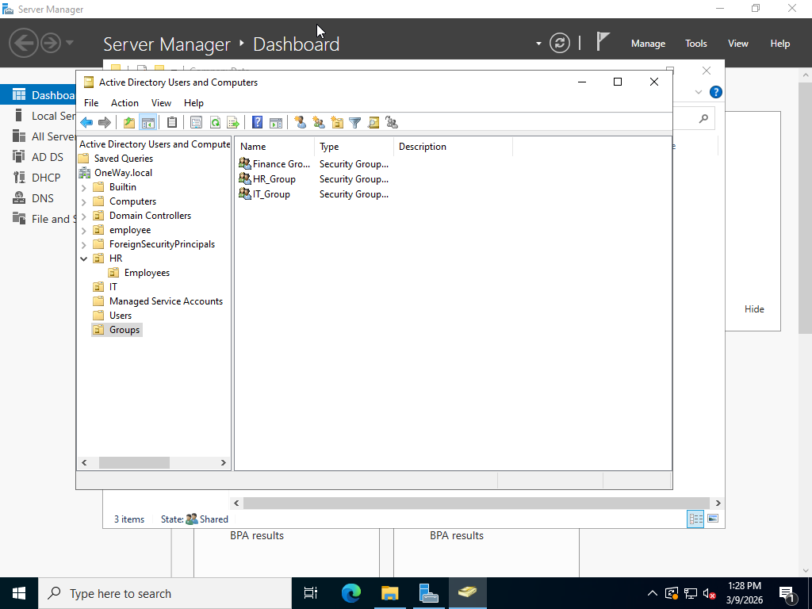
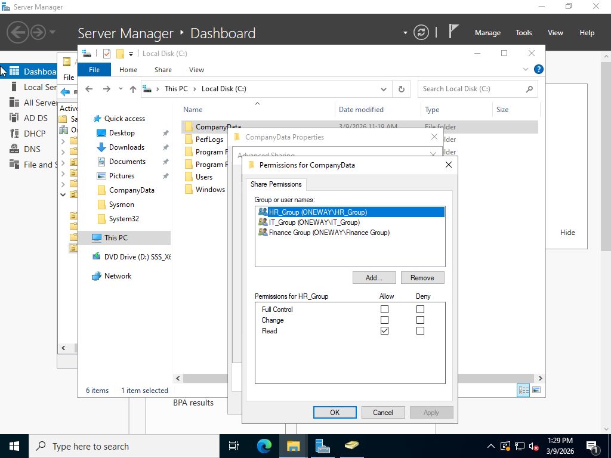
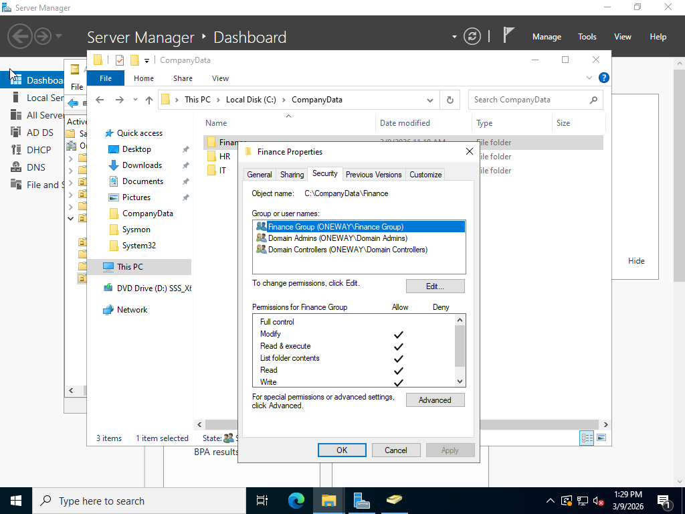
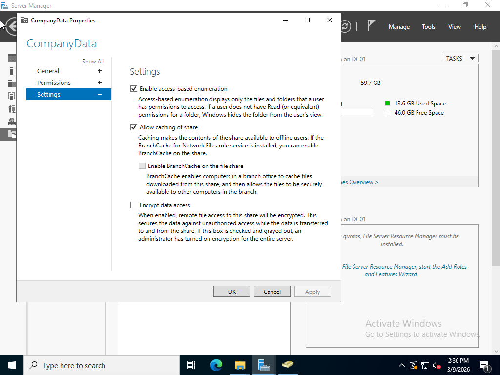
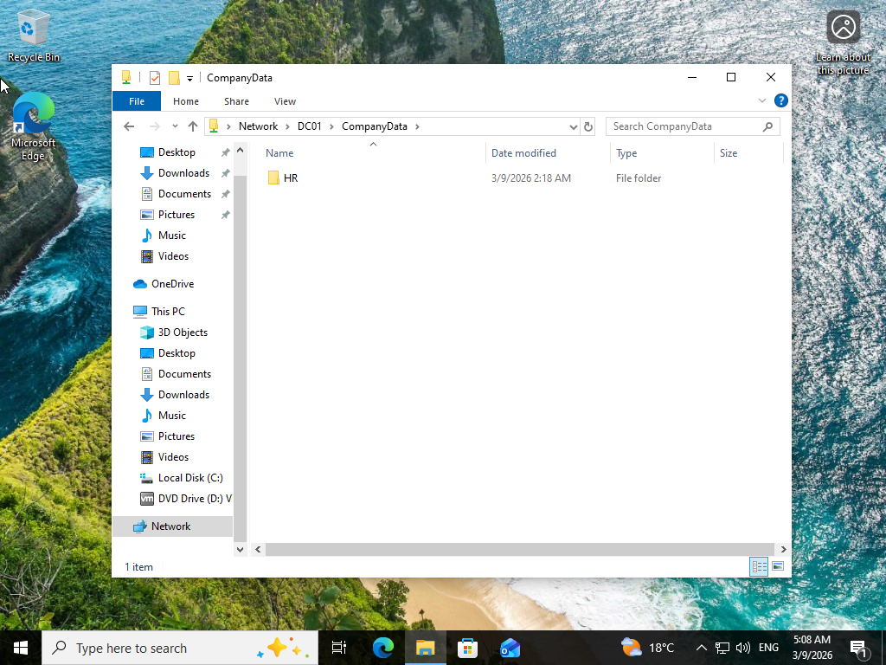

# File Server Permissions Lab

## Overview

This lab demonstrates how to configure a File Server in Windows Server 2022 and manage folder access using Active Directory security groups and NTFS permissions.

## Lab Tasks

* Create department folders (HR, IT, Finance)
* Create security groups
* Assign NTFS permissions
* Share folders
* Enable Access-Based Enumeration

## Result

Users can only access and view folders that belong to their department.

## Technologies

* Windows Server 2022
* Active Directory
* NTFS Permissions
* File Server Role
* 
## Screenshots

### Active Directory Groups

### Shared Folder Creation

### NTFS Permissions Configuration

### Access-Based Enumeration Enabled

### Client Access Test

